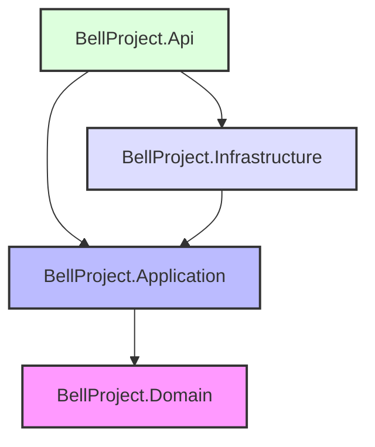
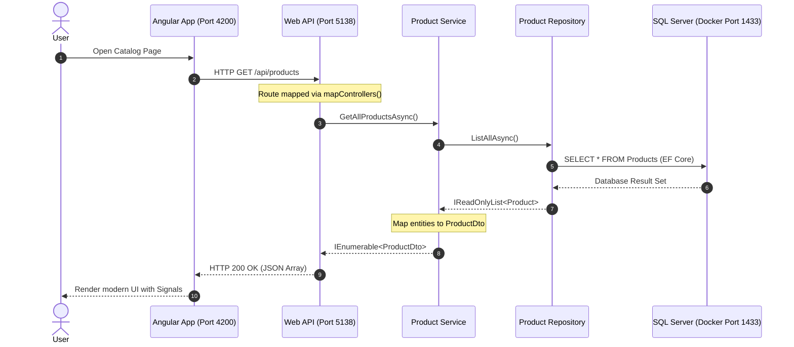

# Product Catalog System (Bell Project)

A modern full-stack product catalog application built with **ASP.NET Core 7** (following Clean Architecture principles) and **Angular** (utilizing Angular Signals for state management), with **SQL Server** running in a Docker container.

---

## 🏗️ Architecture & Data Flow

This project follows **Clean Architecture** (DDD-lite) principles to isolate the domain logic from external concerns (like database frameworks and UI).

### Project Structure Dependency Diagram



* **`BellProject.Domain`**: Core domain layer containing entities (`Product.cs`) and repository interfaces (`IProductRepository.cs`). It has **zero dependencies** on external libraries or other projects.
* **`BellProject.Application`**: Application use-case layer defining DTOs, custom exceptions (`NotFoundException`), service contracts (`IProductService.cs`), and business implementations (`ProductService.cs`).
* **`BellProject.Infrastructure`**: Technical implementation layer containing EF Core database context (`ApplicationDbContext.cs`), database seeding (`DbInitializer.cs`), and repository implementations (`ProductRepository.cs`).
* **`BellProject.Api`**: Presentation layer exposing REST APIs (`ProductsController.cs`) and configuring system wiring (`Program.cs`).

---

### End-to-End Data Flow

The following diagram illustrates the lifecycle of a request when retrieving products:



---

## 🛠️ Tech Stack & Key Decisions

1. **Security (No Hardcoded Secrets)**: 
   * Local connection string credentials are kept safe using **.NET User Secrets** which stores configuration in the local User Profile directory instead of committing passwords to Git.
   * Docker environment variables are read from a git-ignored `.env` file.
2. **Automatic Database Seeding**:
   * The database schema is generated automatically upon API startup (`Database.EnsureCreated()`).
   * A mock list of 5 premium products is automatically seeded if the `Products` table is empty.
3. **Structured Custom Exception Handling**:
   * Utilizes a custom `NotFoundException` containing structured metadata (`ResourceName` and `ResourceKey`) which decouples HTTP status codes from the core application layer.
4. **Modern UI State Management**:
   * The Angular frontend uses **Angular Signals** for reactive state updates, providing micro-animations and instantaneous UI rendering.

---

## 🚀 How to Set Up and Run Locally

### Prerequisites
Make sure you have the following installed on your machine:
* [Docker Desktop](https://www.docker.com/products/docker-desktop/)
* [.NET 7 SDK](https://dotnet.microsoft.com/en-us/download/dotnet/7.0)
* [Node.js (v18+) & npm](https://nodejs.org/)

---

### Step 1: Run the Database Container (Docker)
In the root directory of the project, run:
```bash
docker-compose up -d
```
This downloads and runs the Microsoft SQL Server 2022 container, mapping the default port `1433` and mounting database volume `mssql-data` locally to ensure data persistence.

---

### Step 2: Configure and Run the Backend API

1. **Navigate to the API project directory**:
   ```bash
   cd BellProject.Api
   ```

2. **Initialize User Secrets & Set Connection String**:
   Initialize the secret manager and store the connection string credentials locally (so they don't get saved in `appsettings.json`):
   ```bash
   dotnet user-secrets init
   dotnet user-secrets set "ConnectionStrings:DefaultConnection" "Server=localhost,1433;Database=BellProjectDb;User Id=sa;Password=YourPassword;TrustServerCertificate=True;"
   ```

3. **Run the API**:
   ```bash
   dotnet run
   ```
   The API will start listening on:
   * HTTP: `http://localhost:5138` (redirects automatically to HTTPS)
   * HTTPS: `https://localhost:7140`

---

### Step 3: Run the Frontend Application (Angular)

1. **Navigate to the client directory**:
   ```bash
   cd ../client
   ```

2. **Install node dependencies**:
   ```bash
   npm install
   ```

3. **Start the local Angular development server**:
   ```bash
   npm start
   ```
   Open your browser and navigate to `http://localhost:4200` to view the running application.

---

## 📡 REST API Endpoints

All endpoints are prefixed with `/api/products`:

| HTTP Method | Route | Description | Request Body | Response |
| :--- | :--- | :--- | :--- | :--- |
| **GET** | `/api/products` | Retrieve all products | None | `200 OK` (Array of products) |
| **GET** | `/api/products/{id}` | Retrieve product details | None | `200 OK` / `404 Not Found` |
| **POST** | `/api/products` | Create a new product | `CreateProductDto` | `201 Created` |
| **PUT** | `/api/products/{id}` | Update product details | `UpdateProductDto` | `204 NoContent` / `404 Not Found` |
| **DELETE**| `/api/products/{id}` | Delete a product | None | `204 NoContent` / `404 Not Found` |
